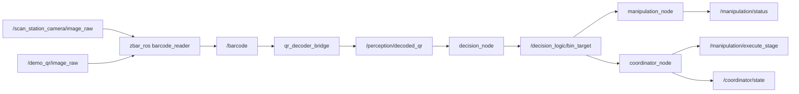
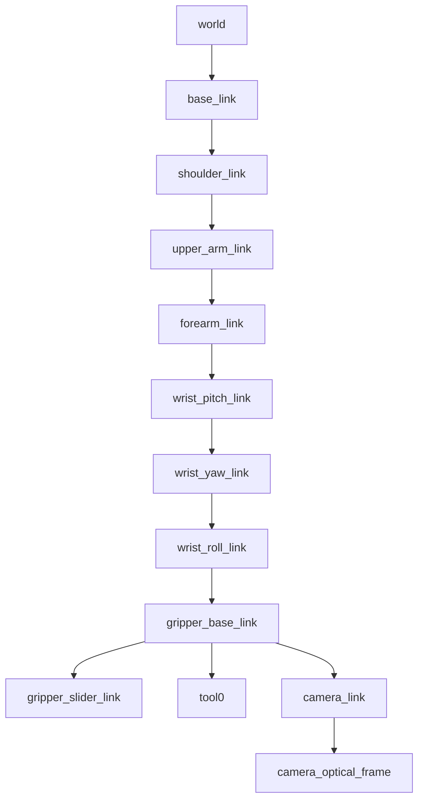

# Industrial Pick-Scan-Place Cell for ROS 2 Humble

This repository contains a modular ROS 2 Humble manipulation project for an industrial pick-scan-place workflow. A 6-DOF arm with a gripper moves to a fixed pick station, grasps a static object, lifts it safely, scans a QR code, routes the object to a destination bin, places it, and returns to a home pose for the next cycle.

The project is organized as a reproducible robotics workspace with clear package boundaries, reusable launch files, parameterized configuration, and deterministic demo support.

## Stack

- ROS 2 Humble
- MoveIt 2
- Gazebo Classic
- RViz 2
- URDF/Xacro
- `ros2_control`
- `zbar_ros`

## Workspace Layout

```text
workspace/
|-- src/
|   |-- robot_description/
|   |-- moveit_config/
|   |-- workflow_interfaces/
|   |-- manipulation/
|   |-- perception/
|   |-- decision_logic/
|   |-- simulation/
|   `-- bringup/
|-- README.md

```

## Package Responsibilities

- `robot_description`: Xacro robot model, collision geometry, inertials, RViz view launch.
- `moveit_config`: SRDF groups, named poses, planner settings, controller config, planning launch.
- `workflow_interfaces`: shared `BinTarget.msg` and `ExecuteStage.srv`.
- `manipulation`: MoveIt 2 execution node for pick, lift, scan, place, and return-home stages.
- `perception`: `zbar_ros` bridge plus a deterministic mock QR image stream for demos.
- `decision_logic`: QR-to-bin mapping and publication of the selected placement pose.
- `simulation`: Gazebo world, object/bin models, and a helper node that attaches the object to the tool during grasp.
- `bringup`: full-stack orchestration launch and coordinator state machine.

## Implemented Workflow

The coordinator drives the following sequence:

1. `IDLE`
2. `MOVE_TO_PICK`
3. `GRASP`
4. `LIFT`
5. `MOVE_TO_SCAN`
6. `WAIT_FOR_QR`
7. `DECIDE_BIN`
8. `MOVE_TO_PLACE`
9. `RELEASE`
10. `RETURN_HOME`
11. `IDLE`

## Robot Model Summary

The robot model is defined in `src/robot_description/urdf/industrial_arm.urdf.xacro` and includes:

- `world -> base_link` fixed anchor
- shoulder pan, shoulder lift, elbow, wrist pitch, wrist yaw, and wrist roll joints
- a prismatic gripper jaw pair
- collision bodies on every arm and gripper link
- inertial tags for every physical link
- `tool0` as the end-effector reference
- `camera_link` and `camera_optical_frame` for wrist-camera simulation

This makes the model ready for both RViz validation and MoveIt 2 integration.

## MoveIt 2 Configuration

The MoveIt package in `src/moveit_config` contains:

- arm planning group: `arm`
- gripper planning group: `gripper`
- end effector: `gripper_ee`
- named arm poses:
  - `home`
  - `pre_grasp`
  - `grasp`
  - `lift`
  - `scan_pose`
  - `bin_a`
  - `bin_b`
  - `bin_c`
- named gripper poses:
  - `gripper_open`
  - `gripper_closed`
- KDL kinematics configuration
- OMPL planning configuration
- controller configuration for `arm_controller` and `gripper_controller`

## Gazebo Environment

The default world in `src/simulation/worlds/pick_scan_place.world` contains:

- ground plane and lighting
- industrial arm mounted at the cell base
- pick table and fixed pick fixture
- static QR-tagged object at a known pick pose
- dedicated scan-station camera near the scan pose
- three bins for sorting

The object is intentionally static and deterministic. No pose estimation is required.

## QR Routing Logic

The default mapping in `src/decision_logic/config/bin_map.yaml` is:

- `RED -> bin_a`
- `BLUE -> bin_b`
- `GREEN -> bin_c`

## Recommended Ubuntu Dependencies

Use Ubuntu 22.04 with ROS 2 Humble.

```bash
sudo apt update
sudo apt install -y \
  ros-humble-desktop \
  ros-humble-moveit \
  ros-humble-moveit-setup-assistant \
  ros-humble-gazebo-ros-pkgs \
  ros-humble-gazebo-ros2-control \
  ros-humble-ros2-control \
  ros-humble-ros2-controllers \
  ros-humble-joint-state-publisher \
  ros-humble-joint-state-publisher-gui \
  ros-humble-robot-state-publisher \
  ros-humble-rviz2 \
  ros-humble-tf2-tools \
  ros-humble-xacro \
  ros-humble-cv-bridge \
  ros-humble-zbar-ros \
  python3-colcon-common-extensions \
  python3-rosdep \
  python3-qrcode \
  python3-pil
```

Initialize `rosdep` once if needed:

```bash
sudo rosdep init
rosdep update
```

## Build Instructions

```bash
source /opt/ros/humble/setup.bash
cd ~/robotics-project
rosdep install --from-paths src --ignore-src -r -y
colcon build --symlink-install
source install/setup.bash
```

## Launch Matrix

### 1. Validate URDF and joint sliders

```bash
ros2 launch robot_description view_robot.launch.py
```

### 2. Validate MoveIt planning in RViz before Gazebo

```bash
ros2 launch moveit_config planning_demo.launch.py
```

This launch is intentionally controllerless. It is meant for planning validation, not full trajectory execution in simulation.

In RViz:

1. Add the `MotionPlanning` display if it is not already present.
2. Select the `arm` planning group.
3. Make sure the planning pipeline is `ompl`, not `chomp`.
4. Test planning through the named states:
   - `home -> pre_grasp`
   - `pre_grasp -> grasp`
   - `grasp -> lift`
   - `lift -> scan_pose`
   - `scan_pose -> bin_a`, `bin_b`, `bin_c`
   - any bin pose back to `home`

### 3. Run the deterministic end-to-end demo

```bash
ros2 launch bringup demo.launch.py use_mock_qr_stream:=true
```

### 4. Run the live camera path through Gazebo

```bash
ros2 launch bringup demo.launch.py use_mock_qr_stream:=false camera_topic:=/scan_station_camera/image_raw
```

Useful runtime checks:

```bash
ros2 topic echo /coordinator/state
ros2 topic echo /perception/decoded_qr
ros2 topic echo /decision_logic/bin_target
ros2 topic echo /manipulation/status
ros2 control list_controllers
```

## MoveIt Setup Assistant Steps

The committed `moveit_config` package is the hand-curated equivalent of a MoveIt Setup Assistant export. If you want to regenerate it through the assistant, keep the same group and pose names so the application nodes continue to work.

1. Launch the assistant:

   ```bash
   ros2 launch moveit_setup_assistant setup_assistant.launch.py
   ```

2. Load `src/robot_description/urdf/industrial_arm.urdf.xacro`.
3. Create a virtual joint from `world` to `base_link`.
4. Generate collision matrix.
5. Create planning group `arm` as a chain from `base_link` to `tool0`.
6. Create planning group `gripper` containing `gripper_joint`.
7. Define end effector `gripper_ee` using the `gripper` group.
8. Add named states:
   - `home`
   - `pre_grasp`
   - `grasp`
   - `lift`
   - `scan_pose`
   - `bin_a`
   - `bin_b`
   - `bin_c`
   - `gripper_open`
   - `gripper_closed`
9. Export the config package and keep:
   - `kinematics.yaml`
   - `joint_limits.yaml`
   - `industrial_arm.srdf`
   - controller configuration

## ROS Interface Summary

### Topics

- `/perception/decoded_qr` (`std_msgs/msg/String`): normalized QR payload from the perception bridge.
- `/decision_logic/bin_target` (`workflow_interfaces/msg/BinTarget`): selected bin id and placement pose.
- `/coordinator/state` (`std_msgs/msg/String`): current state-machine state.
- `/manipulation/status` (`std_msgs/msg/String`): stage execution status encoded as `stage|status|detail`.
- `/barcode` (`std_msgs/msg/String`): raw `zbar_ros` decoded output.
- `/scan_station_camera/image_raw` (`sensor_msgs/msg/Image`): fixed scan camera image topic in Gazebo.
- `/wrist_camera/image_raw` (`sensor_msgs/msg/Image`): wrist-mounted camera topic for alternative experiments.

### Services

- `/manipulation/execute_stage` (`workflow_interfaces/srv/ExecuteStage`)
- `/simulation/set_attachment` (`std_srvs/srv/SetBool`)
- `/simulation/reset_object` (`std_srvs/srv/Trigger`)
- `/coordinator/start_cycle` (`std_srvs/srv/Trigger`)

### Actions

- `/arm_controller/follow_joint_trajectory`
- `/gripper_controller/follow_joint_trajectory`

## Example Topic Graph



## Example TF Tree



## State Machine Structure

The coordinator in `src/bringup/bringup/coordinator_node.py` follows this structure:

```python
IDLE
 -> MOVE_TO_PICK
 -> GRASP
 -> LIFT
 -> MOVE_TO_SCAN
 -> WAIT_FOR_QR
 -> DECIDE_BIN
 -> MOVE_TO_PLACE
 -> RELEASE
 -> RETURN_HOME
 -> IDLE
```

The manipulation node accepts these stage names through `/manipulation/execute_stage`:

- `return_home`
- `move_to_pick`
- `grasp`
- `lift`
- `move_to_scan`
- `move_to_place`
- `release`

## Example `package.xml` Dependencies

For a typical Python ROS 2 application package in this workspace:

```xml
<package format="3">
  <name>decision_logic</name>
  <version>0.1.0</version>
  <description>Decision logic nodes for QR-based bin routing.</description>
  <maintainer email="student@example.com">Robotics Student</maintainer>
  <license>MIT</license>

  <exec_depend>geometry_msgs</exec_depend>
  <exec_depend>rclpy</exec_depend>
  <exec_depend>std_msgs</exec_depend>
  <exec_depend>workflow_interfaces</exec_depend>

  <export>
    <build_type>ament_python</build_type>
  </export>
</package>
```

## Example `setup.py` for Python Nodes

```python
from setuptools import setup

package_name = "decision_logic"

setup(
    name=package_name,
    version="0.1.0",
    packages=[package_name],
    data_files=[
        ("share/ament_index/resource_index/packages", [f"resource/{package_name}"]),
        (f"share/{package_name}", ["package.xml"]),
        (f"share/{package_name}/config", ["config/bin_map.yaml"]),
        (f"share/{package_name}/launch", ["launch/decision.launch.py"]),
    ],
    install_requires=["setuptools"],
    zip_safe=True,
    entry_points={
        "console_scripts": [
            "decision_node = decision_logic.decision_node:main",
        ]
    },
)
```

## Testing Strategy

### Robot description

- Launch `robot_description view_robot.launch.py`
- Verify joint axes by moving one slider at a time
- Confirm `tool0`, `camera_link`, and `camera_optical_frame` appear in TF

### MoveIt planning

- Launch `moveit_config planning_demo.launch.py`
- Plan between all named arm states
- Confirm no self-collision or table collision appears in the planning scene

### Manipulation node

- Call `/manipulation/execute_stage` manually for each stage
- Confirm `/manipulation/status` publishes success and failure feedback
- Force an unreachable pose or invalid state to verify retry behavior

### Perception node

- In deterministic mode, verify `/barcode` and `/perception/decoded_qr`
- In live mode, inspect `/scan_station_camera/image_raw`
- Confirm unsupported QR payloads are rejected cleanly

### Decision node

- Publish `RED`, `BLUE`, and `GREEN` on `/perception/decoded_qr`
- Confirm `bin_a`, `bin_b`, and `bin_c` are published correctly

### Coordinator and integration

- Launch the full bringup stack
- Verify the object resets, gets attached during grasp, routes to the correct bin, and returns home
- Observe `/coordinator/state` across a complete cycle

## Troubleshooting

### RViz shows the robot but planning fails

- Confirm the `arm` group exists in `src/moveit_config/config/industrial_arm.srdf`.
- Check that `tool0` is the end-effector tip in both URDF and SRDF.
- Reduce velocity and acceleration scaling in `src/manipulation/config/poses.yaml` if the planner is too aggressive.

### `move_group` starts but does not respect kinematics or joint limits

- Rebuild after editing `src/moveit_config/config/kinematics.yaml` or `src/moveit_config/config/joint_limits.yaml`.
- Make sure the launch files load those YAML files as dictionaries, not as raw ROS parameter file paths.

### RViz shows missing TF frames

- Confirm `robot_state_publisher` is running.
- Confirm the static transform publisher for `world -> base_link` is active.
- Confirm `/joint_states` exists in RViz-only mode or Gazebo mode.

### Gazebo controllers do not come up

- Check `ros-humble-gazebo-ros2-control` is installed.
- Confirm `src/moveit_config/config/ros2_controllers.yaml` matches the URDF joint names exactly.
- Give Gazebo a few seconds to spawn the robot before inspecting controller status.

### The object does not stay aligned with the tool

- Confirm the attachment offset is consistent between:
  - `src/manipulation/config/poses.yaml`
  - `src/simulation/config/attachment.yaml`
- Check that `tool0` exists in TF.
- Verify `/simulation/set_attachment` is being called when the coordinator enters the grasped phase.

### `zbar_ros` does not detect a QR code

- Start with `use_mock_qr_stream:=true`.
- Confirm the selected image topic matches the launch argument `camera_topic`.
- Increase image size or update rate if testing with a custom camera.

### Xacro or SRDF changes break planning

- Test the model first with:

  ```bash
  ros2 launch robot_description view_robot.launch.py
  ```

- Then test planning separately with:

  ```bash
  ros2 launch moveit_config planning_demo.launch.py
  ```

Only move to Gazebo after those two steps work cleanly.

## Important Files

- `src/robot_description/urdf/industrial_arm.urdf.xacro`
- `src/moveit_config/config/industrial_arm.srdf`
- `src/moveit_config/launch/planning_demo.launch.py`
- `src/manipulation/src/manipulation_node.cpp`
- `src/perception/perception/qr_decoder_bridge.py`
- `src/decision_logic/decision_logic/decision_node.py`
- `src/simulation/worlds/pick_scan_place.world`
- `src/bringup/bringup/coordinator_node.py`
- `src/bringup/launch/demo.launch.py`

## Repository Contents

- full ROS 2 workspace
- URDF/Xacro robot model
- MoveIt 2 configuration package
- Gazebo simulation world
- manipulation, perception, decision, simulation, and coordinator nodes
- modular launch files
- YAML configuration files
- setup and validation instructions in this README
